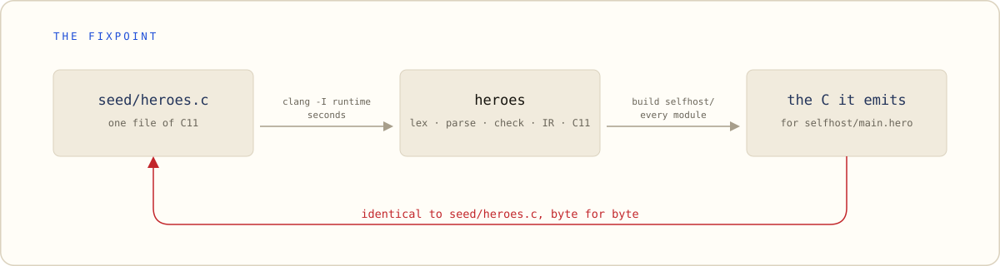

<p align="center">
  <picture>
    <source media="(prefers-color-scheme: dark)" srcset="docs/assets/banner-dark.svg">
    <source media="(prefers-color-scheme: light)" srcset="docs/assets/banner-light.svg">
    
  </picture>
</p>

<h3 align="center">A whole language in one prompt. It <em>compiles itself</em>.</h3>

<p align="center">
  the whole language in <b>fewer than 300 lines</b> &nbsp;&middot;&nbsp;
  measured against a hard ceiling of <b>4096</b> spec tokens<br>
  <b>more than 50,000</b> lines of Heroes that compile themselves &nbsp;&middot;&nbsp;
  <b>0</b> bytes of difference at the fixpoint
</p>

<p align="center">
  <a href="https://heroes-lang.org"><b>heroes-lang.org</b></a> &nbsp;&middot;&nbsp;
  <a href="spec/heroes-spec.md">The spec</a> &nbsp;&middot;&nbsp;
  <a href="design.md">The design</a> &nbsp;&middot;&nbsp;
  <a href="docs/ROADMAP.md">The chain</a> &nbsp;&middot;&nbsp;
  <a href="docs/journal/README.md">The journals</a> &nbsp;&middot;&nbsp;
  <a href="docs/panel/">The panels</a> &nbsp;&middot;&nbsp;
  <a href="examples/">The examples</a>
</p>

A small compiled language designed so that **every plausible mistake an LLM
makes is a compile error**.

Not a language that tolerates a machine writing it — one whose surface is chosen
so that the wrong program does not compile, and the diagnostic arrives with the
repair already written. The bet is stated as a cost formula and measured rather
than asserted; where the measurement is missing, this file says so.

```
function main()
    scores: {str: i64} = {"ziggy": 12, "aladdin": 9}

    for name in sort(keys(scores))
        print(name, " scored ", scores[name].must())
```

The mistake a model makes most often is a name that is almost right. Where
assignment declares, as in Python or JavaScript, a typo quietly becomes a second
variable and the wrong answer leaves at exit 0. Here `@` writes only to a name
that was already declared, so the typo has nowhere to land:

<p align="center">
  <picture>
    <source media="(prefers-color-scheme: dark)" srcset="docs/assets/error-dark.svg">
    <source media="(prefers-color-scheme: light)" srcset="docs/assets/error-light.svg">
    
  </picture>
</p>

Every diagnostic carries three things: the place that is wrong, the other end of
the story, and the repair. A fix tagged `certain` was worked out rather than
guessed, so `heroes check --apply` can write it for you.

## Status: self-hosting is reached, and the chain continues

**The compiler compiles itself.** That is what this project calls v1
(design.md §1.0), and it was reached at M-selfhost-fixpoint on 2026-08-18:
`selfhost/` is this compiler written in Heroes, and the C it emits for its own
source is `seed/heroes.c`, byte for byte. The version number is a different
thing: `heroes --version` says which release you hold, releases are tagged
`vX.Y.Z` and listed under
[Releases](https://github.com/heroes-lang/heroes/releases), and the number stays
below `1.0.0` until a compatibility promise is written. What `0.x` promises until
then is one sentence: **before `1.0.0` the language may change between minor
versions, and a patch version changes no sentence of the spec.**

<p align="center">
  <picture>
    <source media="(prefers-color-scheme: dark)" srcset="docs/assets/fixpoint-dark.svg">
    <source media="(prefers-color-scheme: light)" srcset="docs/assets/fixpoint-light.svg">
    
  </picture>
</p>

**More than half the chain is closed.** Which milestone is in flight, and how
many stand behind it, is `docs/ROADMAP.md` § Where we are — one place, re-measured
at every close, rather than a number here that goes quietly stale. The acceptance
program still runs: a calculator with seven passing tests, across four modules.

| working today | not yet |
|---|---|
| lexer, parser, formatter, resolver, bidirectional type checker | a second backend — the proof that the IR is not C in disguise |
| three-address IR with basic blocks, ownership pass, C11 emission, one `.c` per module behind a build cache | an LSP server, and the editor extension |
| value semantics with copy-on-write, refcounted `str`/`[T]`/`{K: V}` | the rewrite rate — the thesis's third instrument, below |
| generics by monomorphisation, function values, `T?`, `test`/`assert` | an installer of any kind: a tap, a manifest, a flake, an image |
| packages: `use` paths, and where a program's files live | a compatibility promise, which is why the version stays below `1.0.0` |
| threads, isolated, with a stack guard that speaks on every one | the two books |
| an FFI that binds raylib, SDL, SQLite and curl with no shim | |
| `read_file`/`write_file`, `args()`, `exit(code)` | |

The chain from here is `docs/ROADMAP.md` § The chain. What is already built has
one journal each, indexed at `docs/journal/README.md`.

## Build and try it

**A C compiler is the only thing you need.** `seed/heroes.c` is this compiler
written in C — what it emits when it compiles itself — so there is no chicken and
egg and no Rust:

```sh
clang -I runtime seed/heroes.c runtime/runtime.c -o heroes   # seconds
./heroes doctor                                             # what this machine has
./heroes run examples/gallery/00-first.hero
./heroes test examples/calculator/main.hero
```

The compiler you get is the real one: it compiles `selfhost/` — its own source,
**more than 50,000 lines of Heroes across more than 180 files** — and what it
emits for that is `seed/heroes.c` again, byte for byte, in under a minute.
`seed/README.md` is that ritual, including how to get a compiler back if the seed
ever stops building today's source. The digits behind those thresholds are
whatever the four commands above print on your machine, which is the only place
a timing means anything.

Every capability is a subcommand or a flag of the one binary — never a second
binary, never a script, never a Makefile; `heroes --help` prints the current
surface. The Rust bootstrap that used to be the way in is
`archive/bootstrap-rs/`, archived at M-bootstrap-archive and not maintained: the
exception that let `cargo` build the compiler had an expiry date written into it,
and this is it.

> [!NOTE]
> Developed on macOS arm64; CI runs every push on Linux x86-64, and widens to all
> three platforms at a tag. Windows was added on 2026-08-24, when the compiler
> stopped binding `unistd.h` and the last POSIX header left `seed/heroes.c`,
> and the first tag that was supposed to confirm it did the opposite: the
> `m-separate-compilation` run of 2026-08-26 was red on all three platforms at
> three different steps, Windows at `heroes doctor`. **Confirmed since:** after
> the M-argv-execution CI repairs, the full dispatch of 2026-08-31 (run
> 33419946408) is green on all three platforms — Windows x86-64 in 20m28s.
> This file said the red out loud rather than letting a partial green imply
> otherwise, and it says the green the same way: by run id.

## The thesis, and how much of it is measured

The design rule is a cost formula: a construct's cost is its token count times
one plus the rate at which a model rewrites it wrongly. Two of its three
instruments have run — the spec's measured size, held **under a hard ceiling of
4096** tokens by a test that fails the day it is crossed, counted by two vendored
BPE tables so that neither can hide its own drift, with every amendment's cost in
`docs/measurements/010-spec-budget-ledger.md` and the standing figure in
`docs/ROADMAP.md` — and a mutation-based check over the compiler's own corpus. **The third,
the rewrite rate, has not run**, so the formula remains the design rule it always
was and is not yet an audited one. This is written here rather than discovered by
a reader, because measurement beats opinion in this project — including the
author's.

## Where things are written down

| file | what it is |
|---|---|
| `design.md` | the source of truth for the language, and the reasoning behind it |
| `spec/heroes-spec.md` | the contract, budgeted at 4096 tokens — a control instrument, never a tutorial |
| `docs/ROADMAP.md` | the milestone chain, in execution order |
| `DESIGN-LOG.md` | every decision, dated, one line, with its reason |
| `docs/panel/` | the design reviews: five judges with differentiated inputs, their vetoes, and what lifted them |
| `docs/journal/` | one entry per milestone: what was built, what broke, and why |

Where two of them disagree: the spec beats the compiler (the compiler has the
bug), and measurement beats opinion.

## License

Apache-2.0 (`LICENSE`), with the **Heroes runtime exception**
(`LICENSE-RUNTIME-EXCEPTION`): a program you compile with Heroes contains part of
the C runtime and owes nothing for it — no copy of the license, no notice to
reproduce. Attribution is owed by whoever redistributes Heroes itself.

## Contributing

**Issues and questions are welcome. Code is not, yet.** This is one person
learning compilers, on a deliberately unusual set of rules, and every line here
goes through them: they are in `CLAUDE.md`, and the reason each one exists is in
`design.md` or in a panel session. Contributions are meant to open later, and
`CONTRIBUTING.md` names the three conditions that have to be true first, so you
can check them rather than wait. It also says what the licence lets you do
meanwhile: Apache-2.0 grants the fork in writing, and a repository that is not
yet taking patches does not take that back.

<p align="center">
  <sub><a href="https://heroes-lang.org">heroes-lang.org</a> is this language's home, in
  English and Italian: the guide, the examples that run, and the build log.<br>
  The name is an homage to David Bowie's <i>&ldquo;Heroes&rdquo;</i> (1977), and the
  quotation marks are his. The bolt is borrowed from 1973.</sub>
</p>
